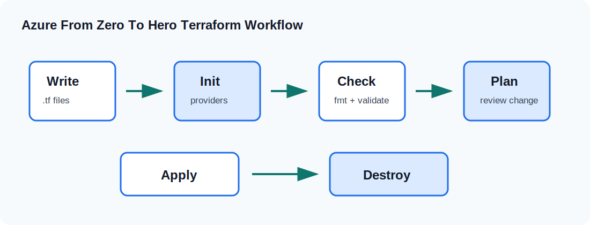

# CLZ-130 - Provider Authentication

## Overview
A provider configuration that can target one explicit subscription.

This lesson is part of the Windows-only Chriz Labz path. It keeps the configuration readable, uses the shared naming model, and avoids hidden prerequisites beyond Azure CLI authentication and Terraform.

## What You Build
| Item | Description |
|---|---|
| Main topic | Azure provider and CLI authentication |
| Azure scope | One resource group tagged for this lesson |
| Default region | `eastus2` |
| Naming style | `clz-dev-clz130-*` |
| Cleanup path | `terraform destroy` from this folder |

## Learning Outcomes
Understand AzureRM provider setup; use subscription_id when needed; avoid accidental deployments.

## Files In This Lab
| File | Purpose |
|---|---|
| `versions.tf` | Terraform and provider constraints |
| `providers.tf` | AzureRM provider configuration |
| `variables.tf` | Inputs shared across the curriculum |
| `locals.tf` | Naming and tag composition |
| `resource-group.tf` | Lesson resource group |
| `lab.tf` | Lesson-specific Azure resources |
| `outputs.tf` | Values used for validation |
| `terraform.tfvars.example` | Safe example inputs |

## Runbook
1. Open this folder in PowerShell.
2. Copy `terraform.tfvars.example` to `terraform.tfvars` only if you need local overrides.
3. Run `terraform init`.
4. Run `terraform fmt -check`.
5. Run `terraform validate`.
6. Run `terraform plan -out tfplan`.
7. Review the plan, then run `terraform apply tfplan`.
8. Capture `terraform output` values needed for validation.

## Validation Checklist
- Resource names start with `clz-dev-clz130`.
- Tags include `Project`, `Environment`, `ManagedBy`, and `Lab`.
- Outputs match the resources created by the plan.
- No local secrets are committed.

## Cleanup
Run `terraform destroy` from this folder. If the lab created shared values for the next lesson, record the outputs first.

## Next Lesson
Standardize names and tags.

