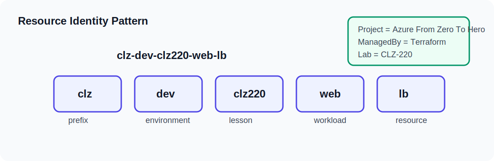

# CLZ-150 - Variables Locals Outputs

## Overview
A configurable lesson folder with safe example values.

This lesson is part of the Windows-only Azure From Zero To Hero path. It keeps the configuration readable, uses the shared naming model, and avoids hidden prerequisites beyond Azure CLI authentication and Terraform.

## What You Build
| Item | Description |
|---|---|
| Main topic | Variables, locals, outputs, and tfvars examples |
| Azure scope | One resource group tagged for this lesson |
| Default region | `eastus2` |
| Naming style | `clz-dev-clz150-*` |
| Cleanup path | `terraform destroy` from this folder |

## Cost Awareness

This lab can create billable Azure resources. Review `terraform plan` before apply, keep defaults small unless the lesson asks you to scale, and run `terraform destroy` from this folder when you finish validation.
## Learning Outcomes
Change behavior with variables; keep derived names in locals; expose useful outputs.

## Files In This Lab
| File | Purpose |
|---|---|
| `versions.tf` | Terraform and provider constraints |
| `providers.tf` | AzureRM provider configuration |
| `variables.tf` | Inputs shared across the curriculum |
| `locals.tf` | Naming and tag composition |
| `resource-group.tf` | Lesson resource group |
| `lab.tf` | Lesson-specific Azure resources |
| `outputs.tf` | Values used for validation |
| `terraform.tfvars.example` | Safe example inputs |

## Runbook
1. Open this folder in PowerShell.
2. Copy `terraform.tfvars.example` to `terraform.tfvars` only if you need local overrides.
3. Run `terraform init`.
4. Run `terraform fmt -check`.
5. Run `terraform validate`.
6. Run `terraform plan -out tfplan`.
7. Review the plan, then run `terraform apply tfplan`.
8. Capture `terraform output` values needed for validation.

## Validation Checklist
- Resource names start with `clz-dev-clz150`.
- Tags include `Project`, `Environment`, `ManagedBy`, and `Lab`.
- Outputs match the resources created by the plan.
- No local secrets are committed.

## Cleanup
Run `terraform destroy` from this folder. If the lab created shared values for the next lesson, record the outputs first.

## Next Lesson
Learn what Terraform records in state.
