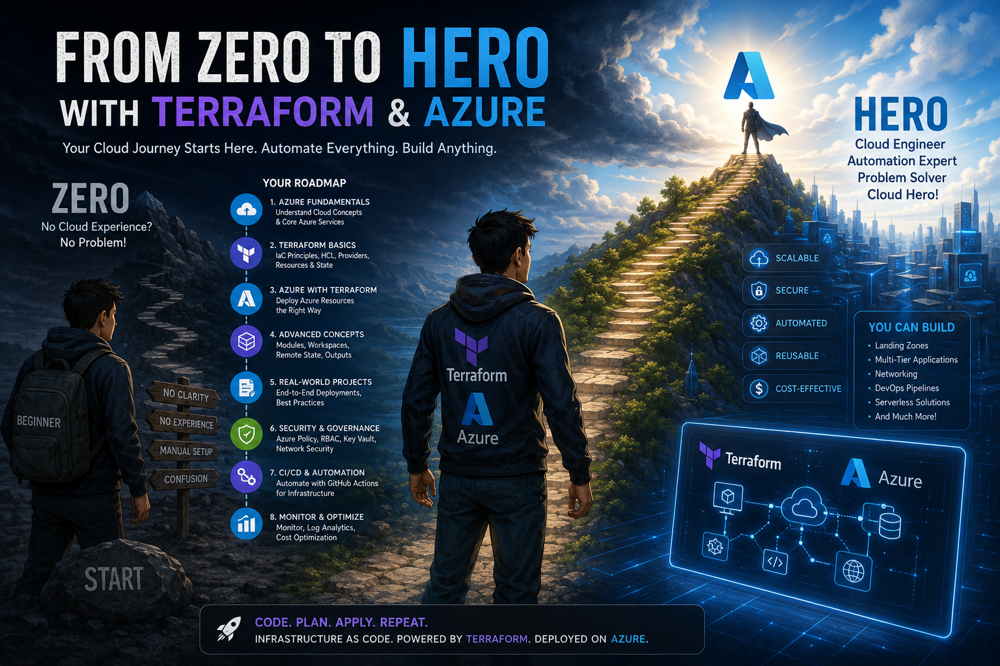
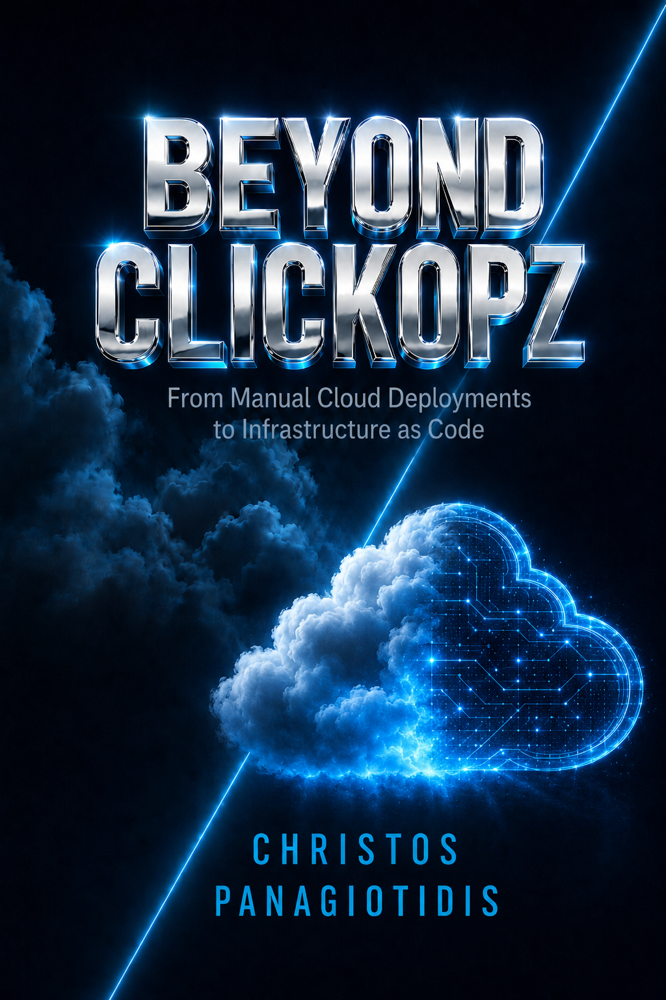
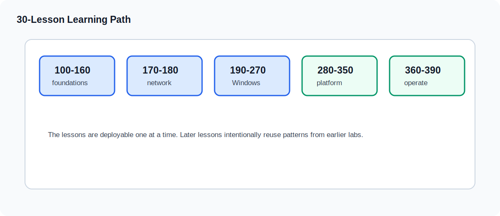
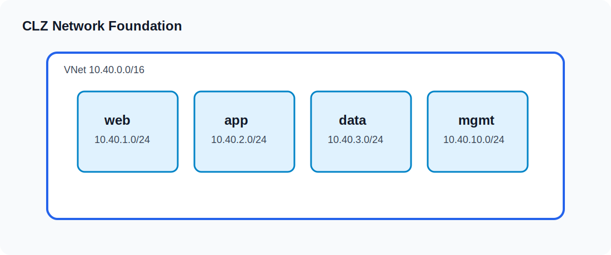
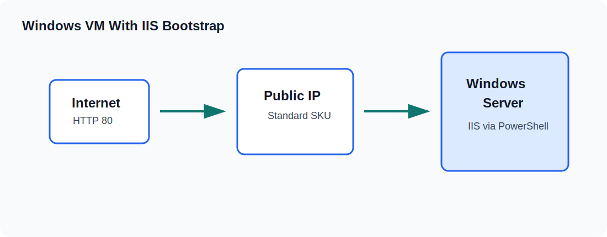
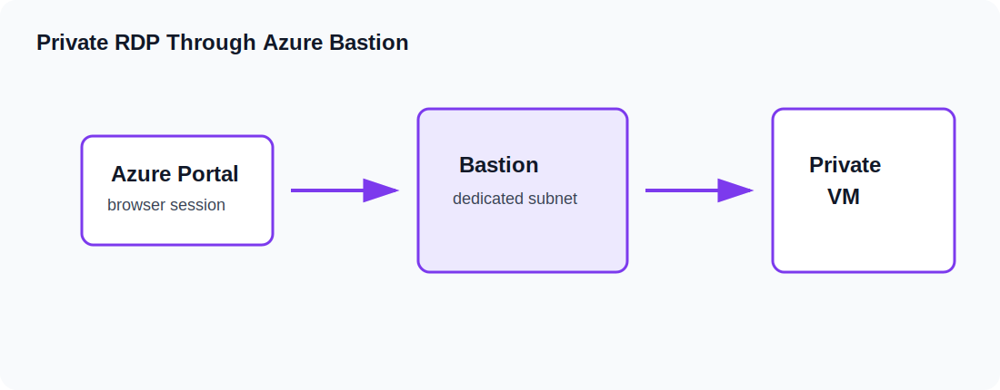
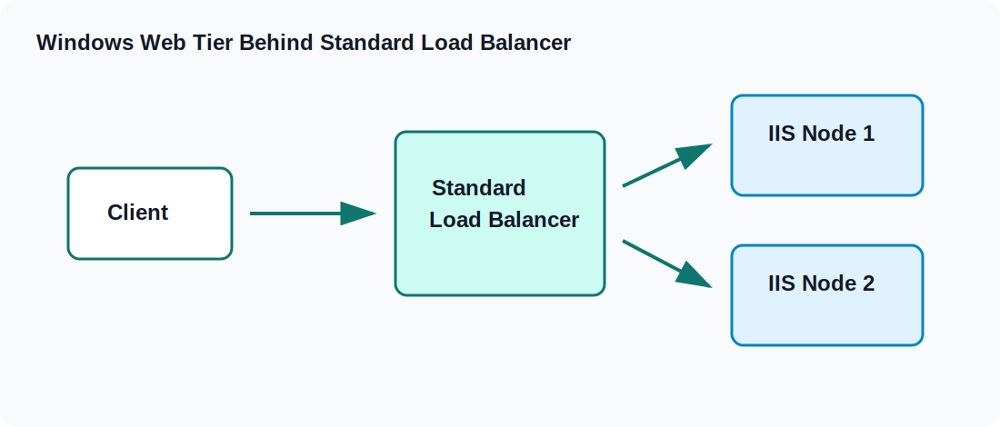
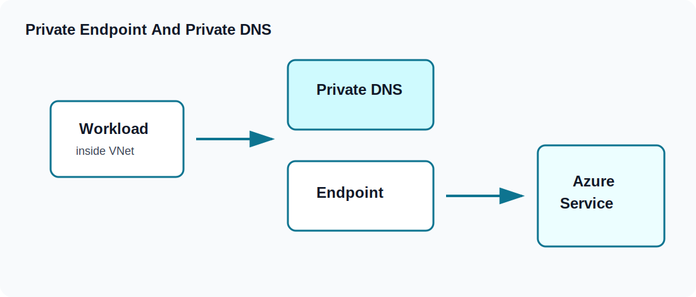
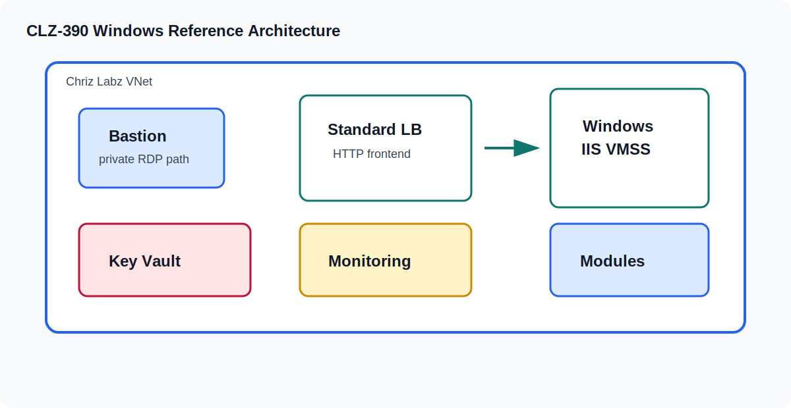

# Azure From Zero To Hero

Azure From Zero To Hero is a Windows-focused Azure Terraform lab library with a free companion book. The labs teach Azure step by step through real Terraform deployments, starting from workstation setup and core workflow, then moving into networking, Windows Server, IIS, Bastion RDP, Load Balancer, VM Scale Sets, remote state, Key Vault, private endpoints, Azure SQL, monitoring, GitHub Actions, and a final reference architecture.

## Free Companion Book

Download the free PDF: [Beyond Clickopz](ClickopzBook.pdf)

The book supports the labs by explaining the learning path, the move from manual cloud work to Infrastructure as Code, and the concepts behind the Terraform exercises. Use it as the reader-friendly guide, then use this repository as the hands-on lab environment.

## Start Here

| Step | Action | Result |
|---:|---|---|
| 1 | Read the free companion book | Understand why the labs move from manual Azure work to Terraform |
| 2 | Prepare the Windows workstation | Install VS Code, Terraform, Azure CLI, Git, and PowerShell tooling |
| 3 | Run the labs in order | Build each Azure pattern with Terraform and PowerShell |
| 4 | Validate each lesson | Use `terraform fmt`, `terraform validate`, and `terraform plan` before applying |
| 5 | Clean up resources | Run `terraform destroy` after each lab unless the next lesson depends on it |

## What Makes This Lab Set Different

- Windows-only implementation path using PowerShell and Windows Server 2022.
- Each lesson is independently deployable and includes cleanup guidance.
- The curriculum uses original names, diagrams, explanations, and Terraform structure.
- The examples use generated secrets and safe `terraform.tfvars.example` files.
- The later lessons move from direct public access toward Bastion, Key Vault, and private endpoints.
- The free book and the Terraform labs are designed to support each other.

## Project Navigation

| Need | Start here |
|---|---|
| Choose the next lesson | [Curriculum](#curriculum) |
| Understand learner outcomes | [Learning outcomes and review rubric](wiki/learning-outcomes-and-review-rubric.md) |
| Control cost and cleanup risk | [Cost governance and lab safety](wiki/cost-governance-and-lab-safety.md) |
| Maintain or release broad updates | [Release and maintenance playbook](wiki/release-and-maintenance-playbook.md) |
| Report a lesson issue | [Support guide](SUPPORT.md) |
| Review security expectations | [Security policy](SECURITY.md) |

## Learning Outcomes

By the end of the path, a learner should be able to:

- Prepare a Windows workstation for Azure Terraform work.
- Explain Terraform init, format, validate, plan, apply, state, outputs, and destroy.
- Build Azure networking foundations with VNets, subnets, NSGs, NAT, DNS, and private endpoints.
- Deploy Windows Server workloads with IIS, Bastion access, Load Balancer, and VM Scale Sets.
- Move from local state to Azure Storage-backed remote state.
- Use Key Vault, monitoring, GitHub Actions, and private Azure SQL access in a coherent reference architecture.
- Review cost, cleanup, public exposure, and secret-handling risk before applying a lab.

## Visual Learning Path

| Phase | Lessons | Outcome |
|---|---:|---|
| Optional setup | 090 | VS Code, Terraform, Azure CLI, Git, and PowerShell workstation readiness |
| Foundations | 100-160 | Terraform workflow, providers, naming, variables, state basics |
| Network | 170-180 | VNet, subnets, NSGs, address planning |
| Windows Compute | 190-270 | Windows VM, IIS, Bastion, Load Balancer, VMSS, autoscale |
| Platform Services | 280-350 | NAT Gateway, DNS, remote state, global routing, Key Vault, private endpoints |
| Operations | 360-390 | Monitoring, GitHub Actions, Azure SQL, final reference architecture |

## Defaults

- Region: `eastus2`
- Prefix: `clz`
- Environments: `dev`, `test`, `prod`
- OS image: Windows Server 2022 Azure Edition
- Web server: IIS
- Automation shell: PowerShell
- Admin path: Azure Bastion RDP after the Bastion lesson

## Curriculum

### Optional Pre-Lab

| Lesson | Link | Name | Topic |
|---:|---|---|---|
| 0 | [CLZ-090](CLZ-090-optional-vscode-terraform-powershell-setup/README.md) | Optional VS Code Terraform PowerShell Setup | VS Code, Terraform, Azure CLI, Git, and PowerShell readiness |

### Core Lessons

| Lesson | Link | Name | Topic |
|---:|---|---|---|
| 1 | [CLZ-100](CLZ-100-foundations/README.md) | Foundations | IaC, Terraform, and Azure lab model |
| 2 | [CLZ-110](CLZ-110-windows-workstation-setup/README.md) | Windows Workstation Setup | Terraform, Azure CLI, VS Code, Git, and PowerShell |
| 3 | [CLZ-120](CLZ-120-terraform-core-workflow/README.md) | Terraform Core Workflow | init, fmt, validate, plan, apply, and destroy |
| 4 | [CLZ-130](CLZ-130-provider-authentication/README.md) | Provider Authentication | Azure provider and CLI authentication |
| 5 | [CLZ-140](CLZ-140-resource-groups-tags/README.md) | Resource Groups And Tags | Resource groups, standard tags, and naming |
| 6 | [CLZ-150](CLZ-150-variables-locals-outputs/README.md) | Variables Locals Outputs | Variables, locals, outputs, and tfvars examples |
| 7 | [CLZ-160](CLZ-160-state-and-locking-basics/README.md) | State And Locking Basics | Local state safety and cleanup discipline |
| 8 | [CLZ-170](CLZ-170-virtual-network-foundation/README.md) | Virtual Network Foundation | VNet, subnets, and address plan |
| 9 | [CLZ-180](CLZ-180-network-security-groups/README.md) | Network Security Groups | NSGs and rule design |
| 10 | [CLZ-190](CLZ-190-windows-vm-basics/README.md) | Windows VM Basics | First Windows VM |
| 11 | [CLZ-200](CLZ-200-windows-vm-iis-bootstrap/README.md) | Windows VM IIS Bootstrap | IIS with PowerShell Custom Script Extension |
| 12 | [CLZ-210](CLZ-210-azure-bastion-rdp/README.md) | Azure Bastion RDP | Bastion subnet, Bastion host, and private RDP |
| 13 | [CLZ-220](CLZ-220-standard-load-balancer-windows/README.md) | Standard Load Balancer Windows | Public Standard Load Balancer with Windows backend |
| 14 | [CLZ-230](CLZ-230-load-balancer-nat-rules/README.md) | Load Balancer NAT Rules | Controlled RDP NAT rule pattern |
| 15 | [CLZ-240](CLZ-240-count-windows-vms/README.md) | Count Windows VMs | Terraform count with Windows VMs |
| 16 | [CLZ-250](CLZ-250-for-each-windows-vms/README.md) | For Each Windows VMs | Terraform for_each with Windows VMs |
| 17 | [CLZ-260](CLZ-260-windows-vmss-manual-scaling/README.md) | Windows VMSS Manual Scaling | Windows VMSS with IIS |
| 18 | [CLZ-270](CLZ-270-windows-vmss-autoscaling/README.md) | Windows VMSS Autoscaling | Autoscale rules and validation |
| 19 | [CLZ-280](CLZ-280-nat-gateway-outbound/README.md) | NAT Gateway Outbound | NAT Gateway for private Windows workloads |
| 20 | [CLZ-290](CLZ-290-private-dns/README.md) | Private DNS | Private DNS zones and internal names |
| 21 | [CLZ-300](CLZ-300-public-dns-optional/README.md) | Public DNS Optional | Public DNS zone pattern |
| 22 | [CLZ-310](CLZ-310-remote-state-storage/README.md) | Remote State Storage | Azure Storage backend |
| 23 | [CLZ-320](CLZ-320-cross-environment-state/README.md) | Cross Environment State | Remote state data between environments |
| 24 | [CLZ-330](CLZ-330-traffic-manager-or-front-door/README.md) | Traffic Manager Or Front Door | Global routing for HTTP endpoints |
| 25 | [CLZ-340](CLZ-340-key-vault-secrets/README.md) | Key Vault Secrets | Key Vault for generated admin secrets |
| 26 | [CLZ-350](CLZ-350-private-endpoint-storage/README.md) | Private Endpoint Storage | Private endpoint and private DNS for Storage |
| 27 | [CLZ-360](CLZ-360-azure-monitor-log-analytics/README.md) | Azure Monitor Log Analytics | Monitoring, alerts, and workspace basics |
| 28 | [CLZ-370](CLZ-370-github-actions-terraform/README.md) | GitHub Actions Terraform | GitHub Actions plan workflow |
| 29 | [CLZ-380](CLZ-380-azure-sql-private-access/README.md) | Azure SQL Private Access | Azure SQL with private access |
| 30 | [CLZ-390](CLZ-390-final-windows-reference-architecture/README.md) | Final Windows Reference Architecture | Modules, VMSS, Bastion, Key Vault, and monitoring |

## Architecture Gallery

| Pattern | Diagram |
|---|---|
| Terraform workflow |  |
| Workstation toolchain |  |
| Network foundation |  |
| Windows IIS VM |  |
| Bastion RDP |  |
| Load-balanced Windows tier |  |
| Remote state |  |
| Private endpoint |  |
| Capstone |  |

## Standard Lab Runbook

Run these commands from an individual lesson folder after reviewing that lesson's README and variables:

~~~powershell
terraform init
terraform fmt -check
terraform validate
terraform plan -out tfplan
terraform apply tfplan
terraform destroy
~~~

## Repo Checks

Use the repository scripts when you want to initialize the workspace or test the Terraform lesson set:

~~~powershell
.\scripts\Initialize-AzureFromZeroToHeroWorkspace.ps1
.\scripts\Test-AzureFromZeroToHeroTerraform.ps1 -Format -Validate -ReportPath artifacts\terraform-validation-report.json
.\scripts\Test-AzureFromZeroToHeroDocs.ps1 -ReportPath artifacts\repo-quality-report.json
~~~

Run the full local quality gate before broad changes or pull requests:

~~~powershell
.\scripts\Test-AzureFromZeroToHeroQuality.ps1 -ReportPath artifacts\quality-report.json
~~~

When Azure CLI authentication is available, you can also run backend-free plan checks for lessons that do not depend on owned public DNS or existing remote state:

~~~powershell
.\scripts\Test-AzureFromZeroToHeroTerraform.ps1 -PlanSafeLessons -ReportPath artifacts\terraform-plan-report.json
~~~

## Quality Gates

GitHub Actions runs separate checks for Terraform format/validation, repository docs, PowerShell analysis, Markdown linting, Terraform linting, and Trivy configuration scanning. The default workflow does not run `terraform apply` and does not require paid Azure deployment credentials.

Local full-quality checks require Terraform, PowerShell 7, Node.js/npm, PSScriptAnalyzer, TFLint, and Trivy. The workstation tooling guide lists install and validation commands.

## Community And Maintenance

- [Contributing guide](CONTRIBUTING.md) explains standards, safety review, and validation expectations.
- [Support guide](SUPPORT.md) explains what to include in lesson questions and bug reports.
- [Security policy](SECURITY.md) explains safe reporting and lab security expectations.
- [Roadmap](ROADMAP.md) tracks near-term curriculum and repository improvements.

## Cost And Cleanup

Many lessons create paid Azure resources. Use a small `instance_count`, keep the default `eastus2` only if it fits your quota, and run `terraform destroy` after each lab unless the next lesson needs its outputs.

## Contributing

Contributions are welcome when they improve the lab path or keep the free book aligned with the hands-on exercises. Useful contributions include fixes to lab steps, Terraform validation notes, diagrams, documentation, cleanup guidance, and book-to-lab references. See [CONTRIBUTING.md](CONTRIBUTING.md) before opening a change.

## References

- [Terraform core concepts](wiki/terraform-core-concepts.md)
- [Windows workstation tooling](wiki/windows-workstation-tooling.md)
- [Azure networking glossary](wiki/azure-networking-glossary.md)
- [Windows VM and VMSS notes](wiki/windows-vm-and-vmss-notes.md)
- [State backend and locking](wiki/state-backend-and-locking.md)
- [Security and secrets](wiki/security-and-secrets.md)
- [Cost governance and lab safety](wiki/cost-governance-and-lab-safety.md)
- [Learning outcomes and review rubric](wiki/learning-outcomes-and-review-rubric.md)
- [Release and maintenance playbook](wiki/release-and-maintenance-playbook.md)
- [Architecture plan](wiki/architecture-plan.md)
- [Final reference architecture plan](wiki/final-reference-architecture-plan.md)
- [Troubleshooting](wiki/troubleshooting.md)
