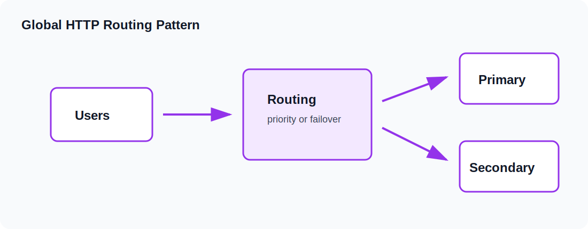

# Azure Networking Glossary

Azure networking is the base layer for almost every Chriz Labz lesson after the first few Terraform fundamentals. Windows VMs, IIS sites, Azure Bastion, Load Balancer, VM Scale Sets, NAT Gateway, Private DNS, Private Endpoint, Azure SQL, and monitoring all depend on network decisions made early in the lab path.

This guide explains the networking vocabulary used in the curriculum. It is written as a practical field reference, not as a dictionary of every Azure networking feature. The goal is to help you understand why each resource exists, what problem it solves, and how it relates to the Terraform files in the lesson folders.

## Resource Group

A resource group is the management boundary for one lesson. In Chriz Labz, every lesson creates a resource group named with the lesson ID, such as `clz-dev-clz170-rg`. The resource group gives you a clean place to inspect resources, confirm tags, and run cleanup.

Resource groups are not network containers by themselves. They can contain resources from many regions, although the lab keeps resources in one region unless a lesson is specifically about global routing. The resource group location mostly affects metadata. Individual resources still have their own location arguments.

The standard resource group pattern is:

~~~hcl
resource "azurerm_resource_group" "lab" {
  name     = "${local.prefix}-rg"
  location = var.location
  tags     = local.tags
}
~~~

The resource group appears in almost every other resource through `resource_group_name = azurerm_resource_group.lab.name`.

## Virtual Network

A virtual network, or VNet, is a private address space in Azure. It is the largest network boundary used in the lab architecture. Resources inside a VNet can communicate over private addresses when routing and security rules allow it.

The standard Chriz Labz VNet uses:

| Setting | Value |
|---|---|
| Address space | `10.40.0.0/16` |
| Web subnet | `10.40.1.0/24` |
| App subnet | `10.40.2.0/24` |
| Data subnet | `10.40.3.0/24` |
| Management subnet | `10.40.10.0/24` |

The address space is intentionally larger than the current subnet set. That leaves room for later lessons without forcing a redesign. Address planning is easier before resources exist. Changing address spaces later can be disruptive, especially when private endpoints and delegated services are involved.

## Subnets

A subnet is a smaller address range inside the VNet. Chriz Labz uses role-based subnet names:

| Subnet | Purpose |
|---|---|
| `web-snet` | Public-facing or load-balanced web workloads |
| `app-snet` | Application tier expansion |
| `data-snet` | Private endpoints and database access |
| `mgmt-snet` | Management resources and admin paths |
| `AzureBastionSubnet` | Required subnet name for Azure Bastion |

Subnets help separate traffic and apply controls. They also make the architecture readable. When a private endpoint is in `data-snet`, you can infer its purpose. When a Windows web node is in `web-snet`, you can infer it serves the front end.

Subnet size matters. Azure reserves several addresses in every subnet. Dedicated services also have size guidance. Azure Bastion requires the subnet name `AzureBastionSubnet` and should use a range large enough for the service. The lab uses a `/26` for Bastion examples.

## Network Interface

A network interface, or NIC, attaches a VM to a subnet. It contains one or more IP configurations. For basic Windows VM lessons, the NIC points to the web subnet and may include a public IP association. For later private patterns, the NIC has only a private address.

Example:

~~~hcl
resource "azurerm_network_interface" "web" {
  name                = "${local.prefix}-web-nic"
  location            = azurerm_resource_group.lab.location
  resource_group_name = azurerm_resource_group.lab.name

  ip_configuration {
    name                          = "internal"
    subnet_id                     = azurerm_subnet.web.id
    private_ip_address_allocation = "Dynamic"
  }

  tags = local.tags
}
~~~

NICs are important because many network relationships happen there: backend pool associations, NAT rule associations, and private IP addresses.

## Private IP Addressing

Private IP addresses are used inside the VNet. A dynamic private IP in Azure is stable while the NIC exists, but it is still allocated by Azure. Static private IPs are useful when a record or allow rule must point to a predictable address.

In the early labs, dynamic private allocation keeps configuration simple. In private DNS examples, static records are introduced to explain name resolution. In production-style designs, the better pattern is often to output actual private addresses from resources instead of hard-coding records manually.

## Public IP Address

A public IP gives an Azure resource an internet-routable endpoint. Chriz Labz uses public IPs only when a lesson needs them:

| Lesson type | Why a public IP may exist |
|---|---|
| First Windows VM | Simple access and validation |
| IIS bootstrap | HTTP validation |
| Load Balancer | Public frontend for web traffic |
| Bastion | Required public endpoint for the Bastion service |
| NAT Gateway | Stable outbound egress address |

Public IPs are not automatically bad, but they should be intentional. Later lessons move admin and platform access toward private paths.

## Network Security Group

A network security group, or NSG, contains rules that allow or deny traffic. NSGs can be associated with subnets or NICs. Chriz Labz primarily uses subnet-level associations so the rule is easy to reason about.

Each rule has:

| Field | Meaning |
|---|---|
| Direction | Inbound or outbound |
| Priority | Lower number wins |
| Access | Allow or deny |
| Protocol | TCP, UDP, ICMP, or wildcard |
| Source | Who traffic comes from |
| Destination | Where traffic goes |
| Port | Which port is matched |

Example web rules include HTTP on port 80 and scoped RDP on port 3389 for early learning. The `admin_cidr` variable should be narrowed to your real trusted source range before any direct admin access is used.

## Rule Priority

NSG priorities decide which rule wins when more than one rule could match. Lower priority numbers are evaluated first. A rule with priority `100` is evaluated before one with priority `110`.

Good practice is to leave gaps between rule numbers. That gives you room to insert a rule later without renumbering everything. The lab uses simple numbers because the rule sets are intentionally small.

## Azure Bastion

Azure Bastion provides browser-based RDP to VMs over a private address. The VM does not need a public IP. Bastion itself uses a public IP and a dedicated subnet named `AzureBastionSubnet`.

Bastion is a turning point in the curriculum. Before Bastion, a lesson may expose direct admin access for learning. After Bastion, private RDP is the preferred model. That shift mirrors a more mature operations pattern: public entry points are minimized, and administrative traffic stays controlled.

Key Bastion pieces:

| Resource | Purpose |
|---|---|
| `AzureBastionSubnet` | Required subnet for the service |
| Bastion public IP | Public endpoint for the managed service |
| Bastion host | Azure-managed RDP access broker |
| Private VM NIC | Target of the RDP session |

## Standard Load Balancer

Azure Standard Load Balancer distributes layer 4 traffic. In Chriz Labz, it is used for HTTP delivery to Windows IIS backends and for a controlled NAT rule example.

A basic load balancer pattern contains:

| Component | Description |
|---|---|
| Frontend IP configuration | The address clients connect to |
| Backend pool | The group of backend NICs or VMSS instances |
| Health probe | Checks whether a backend is available |
| Load balancing rule | Maps frontend traffic to backend traffic |
| NAT rule | Optional direct mapping to one backend port |

The HTTP load-balancer lessons use a TCP probe on port 80. If the IIS extension fails, the probe does not succeed and traffic does not flow as expected. That makes the load balancer a useful validation point for the compute bootstrap.

## Backend Pool

A backend pool is the set of targets that can receive traffic. For individual VM lessons, NICs are associated with the pool. For VMSS lessons, the VMSS network profile references the backend pool.

Backend pool membership is a common place to troubleshoot. If the frontend exists and the probe exists but traffic fails, check whether the backend NIC or VMSS instance is actually in the pool.

## Health Probe

A health probe tells the load balancer whether a backend should receive traffic. A TCP probe checks whether a port is reachable. An HTTP probe can check a path, but the lab keeps the load-balancer probe simple.

The probe should reflect the real application entry point. For IIS examples, port 80 is enough. For more advanced applications, a dedicated health endpoint is usually better.

## NAT Gateway

NAT Gateway provides stable outbound access for a subnet. It is not an inbound access feature. It answers the question: "What public IP does this private workload use when it reaches outbound services?"

In the lab, NAT Gateway is attached to a subnet through `azurerm_subnet_nat_gateway_association`. A public IP is associated with the gateway. Resources in the subnet can then use that public IP for outbound traffic without receiving inbound public access.

NAT Gateway is useful because outbound identity becomes predictable. That can matter for allow lists, auditing, and service access policies.

## Private DNS

Private DNS provides name resolution inside a VNet. A private DNS zone is linked to the VNet, and records inside the zone resolve for resources that use that VNet's DNS path.

Chriz Labz uses private DNS in two patterns:

| Pattern | Example |
|---|---|
| Internal application names | `web.clz.internal` |
| Private endpoint service zones | `privatelink.blob.core.windows.net` |

Internal zones teach the DNS concept. Private endpoint zones make Azure platform services resolve to private endpoint addresses.

## Private Endpoint

A private endpoint is a network interface in your VNet that connects privately to an Azure platform service. It is used for Storage and Azure SQL lessons.

The private endpoint pattern has three important parts:

1. The service, such as a storage account or Azure SQL server.
2. The private endpoint in a subnet.
3. The private DNS zone that resolves the service name to the private endpoint.

If DNS is wrong, the private endpoint can exist but clients may still try to reach the public service name. That is why private endpoint lessons always pair the endpoint with private DNS.

## Public DNS

Public DNS zones are optional in Chriz Labz because not every lab user owns a domain. The public DNS lesson uses a boolean variable so the resource is not created accidentally.

Public DNS is useful when you need internet clients to resolve a name to a public service. The lab explains the shape without requiring domain delegation.

## Traffic Manager And Global Routing

Traffic Manager is a DNS-based global routing service. It does not proxy the traffic. It returns different DNS answers based on routing method and endpoint health.

The global routing lesson uses external endpoint host names so it can teach routing without requiring every lab user to build two full regions first. The lesson introduces priority routing and endpoint monitoring. The same concept can later be expanded to multiple regional deployments.

## Service Endpoints And Private Endpoints

Service endpoints and private endpoints are different patterns. Chriz Labz focuses on private endpoints because they make the private network path visible and pair well with private DNS.

Private endpoints create a private IP in your VNet. That private IP becomes the service access point. This is a clear model for storage and database lessons.

## Network Troubleshooting Order

When traffic fails, troubleshoot from the simplest layer outward:

| Step | Question |
|---|---|
| 1 | Does the resource exist in the expected resource group? |
| 2 | Is the resource in the expected region? |
| 3 | Is the NIC attached to the expected subnet? |
| 4 | Does the subnet have the expected NSG? |
| 5 | Does the NSG allow the traffic? |
| 6 | If using a load balancer, is the backend in the pool? |
| 7 | If using a probe, is the backend service listening? |
| 8 | If using private endpoint, does DNS resolve to a private address? |

This order prevents wasted time. Do not start with global routing when the VM extension has not installed IIS. Do not troubleshoot private DNS before confirming the private endpoint exists.

## How Terraform References Shape The Network

Terraform references express network dependencies. A subnet references the VNet name. A NIC references the subnet ID. A load balancer backend association references both the NIC and backend pool. Those references are the real graph.

When reading a network lesson, follow the IDs:

1. Resource group name.
2. VNet name.
3. Subnet ID.
4. NIC subnet reference.
5. Public IP or private endpoint reference.
6. Outputs used for validation.

This habit makes larger diagrams less intimidating because you can trace one connection at a time.

## Naming And Tags In Network Resources

Network resources should be easy to identify in Azure. The lab uses names like:

| Resource | Example |
|---|---|
| Resource group | `clz-dev-clz170-rg` |
| VNet | `clz-dev-clz170-vnet` |
| Web NSG | `clz-dev-clz180-web-nsg` |
| Load Balancer | `clz-dev-clz220-web-lb` |
| NAT Gateway | `clz-dev-clz280-natgw` |

Tags add another search dimension. The `Lab` tag is especially useful when you need to find all resources from one lesson.

## Summary

Azure networking in Chriz Labz is built in layers. First you create a VNet and subnets. Then you apply NSGs. Then you attach Windows workloads. Then you add public delivery with Load Balancer, private administration with Bastion, stable outbound access with NAT Gateway, name resolution with DNS, private service access with Private Endpoint, and global routing with Traffic Manager. Each layer teaches a separate responsibility, and together they form the network foundation for the final Windows reference architecture.
