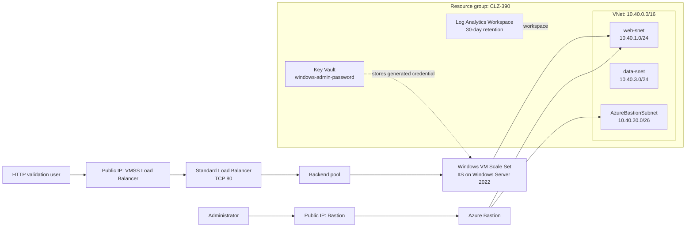

# CLZ-390 Final Windows Reference Architecture Plan

This document defines the professional target architecture represented by `CLZ-390-final-windows-reference-architecture`. It is based on the final Terraform implementation in the lab and explains the design, traffic flow, security posture, operations model, validation path, and future hardening steps.

## Executive Summary

CLZ-390 delivers the final Windows reference architecture for Azure From Zero To Hero. It combines the reusable network module, a load-balanced Windows IIS VM Scale Set, Azure Bastion for private administration, Key Vault for generated administrator credentials, and Log Analytics for operational visibility.

The design is intentionally small enough for a lab while still showing the architecture pattern learners should move toward: modular Terraform, private administration, centralized secrets, standard tagging, predictable network ranges, and clear validation and cleanup.

## Architecture Objectives

| Objective | Design response |
|---|---|
| Teach a complete Windows Azure pattern | Deploy VNet, subnets, VMSS, IIS, Load Balancer, Bastion, Key Vault, and Log Analytics together |
| Keep the design reproducible | Use Terraform modules, standard variables, generated passwords, and lesson-level outputs |
| Avoid direct VM administration from the public internet | Use Azure Bastion for RDP instead of public RDP on VM instances |
| Centralize sensitive values | Store the generated Windows administrator password in Key Vault |
| Keep learner cost controlled | Use a small VMSS instance count, standard lab defaults, and explicit cleanup guidance |
| Preserve beginner readability | Compose only stable late-course modules and keep capstone-specific services visible in the lesson |

## Scope

This architecture includes:

| Area | Included components |
|---|---|
| Compute | Windows Server 2022 Azure Edition VM Scale Set with IIS |
| Network | VNet, web subnet, data subnet, Bastion subnet, Standard public Load Balancer |
| Management | Azure Bastion for private RDP access |
| Secrets | Key Vault and generated Windows admin password |
| Monitoring | Log Analytics workspace |
| Delivery | Terraform local runbook and repository validation scripts |

This architecture does not include production governance, centralized enterprise identity design, hub-and-spoke connectivity, Azure Firewall, DDoS Protection, private DNS integration for Key Vault, diagnostic settings for every resource, or a persistent remote backend inside the capstone lesson. Those are future hardening steps after the lab design is understood.

## Target Architecture Diagram



## Component Design

| Component | Terraform source | Purpose | Key design notes |
|---|---|---|---|
| Resource group | `resource-group.tf` | Deployment boundary for the capstone | Uses shared lesson tags and naming |
| Network core | `modules/network-core` | Creates the VNet and application subnets | VNet `10.40.0.0/16`, `web-snet`, and `data-snet` |
| Windows IIS VMSS | `modules/windows-iis-vmss` | Hosts the scalable IIS web tier | Standard_B2s, Windows Server 2022 Azure Edition, manual upgrade mode |
| Standard Load Balancer | `modules/windows-iis-vmss` | Publishes HTTP access to the VMSS | Public frontend, TCP probe on port 80, backend rule on port 80 |
| Azure Bastion | `capstone.tf` | Provides private RDP administration | Uses required `AzureBastionSubnet` with `/26` address space |
| Key Vault | `capstone.tf` | Stores generated Windows admin password | Standard SKU, 7-day soft delete retention for lab recovery |
| Log Analytics | `capstone.tf` | Provides an operations workspace | PerGB2018 SKU, 30-day retention |
| Outputs | `outputs.tf` | Exposes values for validation | Includes resource group, location, load balancer URL, Key Vault name, and sensitive admin password |

## Network Design

| Network element | Addressing or port | Purpose |
|---|---|---|
| VNet | `10.40.0.0/16` | Shared private network boundary for the capstone |
| `web-snet` | `10.40.1.0/24` | Hosts the Windows IIS VMSS network interfaces |
| `data-snet` | `10.40.3.0/24` | Reserved for data-tier expansion and later private service patterns |
| `AzureBastionSubnet` | `10.40.20.0/26` | Required subnet for Azure Bastion |
| Load Balancer frontend | TCP `80` | Public HTTP validation endpoint |
| Load Balancer backend | TCP `80` | Sends web traffic to IIS instances |
| Bastion path | RDP through Azure Bastion | Administrative access without public VM RDP exposure |

## Traffic Flow

| Flow | Path | Validation result |
|---|---|---|
| Public HTTP | User -> Public IP -> Standard Load Balancer -> VMSS backend pool -> IIS | Browser or `Invoke-WebRequest` returns the capstone IIS page |
| Private administration | Administrator -> Azure Portal -> Bastion -> VMSS instance private IP | RDP session reaches the Windows instance without public RDP |
| Secret retrieval | Authorized operator -> Key Vault -> `windows-admin-password` | Password can be retrieved by the current lab identity |
| Terraform operations | PowerShell -> Terraform -> AzureRM provider -> Azure Resource Manager | Plan and apply create the declared architecture |

## Security Design

| Control | Implementation | Notes |
|---|---|---|
| Generated credential | `random_password.windows_admin` | Avoids hard-coded Windows passwords in Terraform files |
| Centralized secret storage | Key Vault secret `windows-admin-password` | Secret output remains marked sensitive in Terraform |
| Private administration | Azure Bastion | Final architecture avoids direct public RDP to VMSS instances |
| Scoped identity access | Key Vault access policy for the current client identity | Suitable for a learner lab; production should prefer stricter RBAC governance |
| Standard tagging | Shared `local.tags` | Supports cost review, cleanup, and resource ownership |
| Cleanup control | `terraform destroy` from the lesson folder | Prevents abandoned paid lab resources |

Important lab caveat: purge protection is disabled in this lesson so learners can fully clean up resources during repeated lab runs. A production Key Vault should normally enable purge protection and use stricter recovery policies.

## Operations Design

| Operational need | Current design | Professional next step |
|---|---|---|
| Resource visibility | Standard tags and predictable names | Add Azure Policy for required tags |
| Basic monitoring | Log Analytics workspace | Add diagnostic settings from VMSS, Load Balancer, Key Vault, and Bastion |
| Web availability check | Public load balancer URL output | Add Azure Monitor availability tests and alert rules |
| Secret management | Generated password stored in Key Vault | Move to RBAC-based Key Vault authorization and rotation workflow |
| Scaling model | VMSS instance count input | Add autoscale rules from CLZ-270 when moving beyond the static capstone |
| Deployment evidence | Terraform outputs and JSON validation reports | Attach reports to pull requests and release notes |

## Deployment Plan

Run the capstone from `CLZ-390-final-windows-reference-architecture`:

```powershell
terraform init
terraform fmt -check
terraform validate
terraform plan -out tfplan
terraform apply tfplan
terraform output
```

Validate the whole repository from the root:

```powershell
.\scripts\Test-AzureFromZeroToHeroTerraform.ps1 -Format -Validate -ReportPath artifacts\terraform-validation-report.json
.\scripts\Test-AzureFromZeroToHeroDocs.ps1 -ReportPath artifacts\repo-quality-report.json
```

When Azure CLI authentication is available, run backend-free safe plans for supported lessons:

```powershell
.\scripts\Test-AzureFromZeroToHeroTerraform.ps1 -PlanSafeLessons -ReportPath artifacts\terraform-plan-report.json
```

## Validation Plan

| Validation | Command or check | Expected result |
|---|---|---|
| Formatting | `terraform fmt -check` | No formatting drift |
| Static Terraform validation | `terraform validate` | Configuration is valid |
| Plan review | `terraform plan -out tfplan` | Planned resources match this architecture |
| HTTP endpoint | `terraform output capstone_load_balancer_url` then browser or `Invoke-WebRequest` | IIS page responds through the Load Balancer |
| Key Vault | Confirm `key_vault_name` and secret existence | Generated password is stored as `windows-admin-password` |
| Bastion | Start Bastion RDP from the Azure portal | VMSS instance can be administered privately |
| Cleanup | `terraform destroy` | Resource group resources are removed |

## Cost And Cleanup Plan

The capstone creates billable resources, including Windows compute, Load Balancer, Bastion, Key Vault, Public IPs, and Log Analytics. Keep `instance_count` low during learning, review the plan before apply, and destroy the deployment when validation is complete.

```powershell
terraform destroy
```

If a learner needs to preserve evidence before cleanup, capture:

| Evidence | Source |
|---|---|
| Load balancer URL | `terraform output capstone_load_balancer_url` |
| Key Vault name | `terraform output key_vault_name` |
| Resource group | `terraform output resource_group_name` |
| Screenshot | Browser result from the public load balancer URL |

## Design Decisions And Tradeoffs

| Decision | Reason | Tradeoff |
|---|---|---|
| Use modules only for stable late-course patterns | Reinforces reuse after learners have built the pattern manually | Less abstraction than a production platform module stack |
| Keep Load Balancer public for HTTP validation | Makes lab success easy to verify | Production designs may place the app behind private ingress or an application gateway |
| Use Bastion for management | Removes public RDP exposure from the final design | Bastion adds cost while the lab is running |
| Store password in Key Vault | Teaches centralized secret handling | Full enterprise rotation is out of scope |
| Disable Key Vault purge protection | Allows repeatable learner cleanup | Production Key Vaults should usually enable purge protection |
| Use Log Analytics as a workspace only | Introduces the operations layer | Deeper diagnostics and alerts are future enhancements |

## Future Hardening Roadmap

| Priority | Enhancement | Benefit |
|---:|---|---|
| 1 | Add diagnostic settings for VMSS, Load Balancer, Key Vault, and Bastion | Improves operational visibility |
| 2 | Add Azure Monitor alerts for HTTP availability and VMSS health | Turns monitoring into actionable operations |
| 3 | Add autoscale rules from the CLZ-270 pattern | Makes the compute tier adaptive |
| 4 | Add private endpoint and private DNS for Key Vault | Reduces public service exposure |
| 5 | Move Key Vault authorization to Azure RBAC | Aligns with modern governance patterns |
| 6 | Add remote state backend instructions for the capstone | Improves team reproducibility |
| 7 | Add optional Application Gateway or Front Door front end | Supports richer HTTP routing and edge controls |

## Acceptance Criteria

The final architecture is complete when:

| Criterion | Evidence |
|---|---|
| Terraform validates cleanly | `terraform validate` succeeds in the CLZ-390 folder |
| The repository quality gate passes | Root validation scripts produce successful JSON reports |
| Public HTTP works | The load balancer URL returns the IIS capstone page |
| Private administration works | Bastion can connect to a VMSS instance |
| Secret storage works | Key Vault contains the generated Windows admin password |
| Cleanup works | `terraform destroy` removes the lab resources |

This architecture is the final learning-state design for the repository: practical, modular, Windows-focused, and ready for learners to extend into a more production-grade pattern after they understand the full path.
