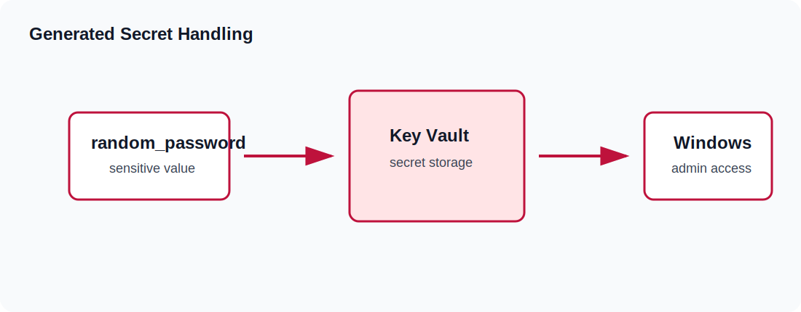

# Security And Secrets

Security in Azure From Zero To Hero is taught as a progression. The early lessons keep access simple so that the Terraform resource relationships are easy to see. Later lessons tighten the model with Azure Bastion, generated credentials, sensitive outputs, Key Vault, private endpoints, and clearer separation between public delivery and private administration.

This page explains the security decisions used across the curriculum. It focuses on practical lab safety: how credentials are generated, what sensitive output means, how state affects secrets, how RDP access should evolve, why Key Vault is introduced, and how private endpoints reduce public exposure for platform services.

## Security Goals

Azure From Zero To Hero uses a few consistent security goals:

| Goal | Practice |
|---|---|
| Avoid committed secrets | Use generated values and local-only overrides |
| Keep admin access narrow | Use `admin_cidr` and later Azure Bastion |
| Separate public and private paths | Public HTTP is not the same as admin access |
| Use tags for ownership | Make cleanup and review easier |
| Teach private service access | Use Private Endpoint and Private DNS |
| Keep lessons understandable | Add controls in stages |

The curriculum is not trying to be a full enterprise security baseline. It is a learning path that builds safer habits while keeping each lesson readable.

## Generated Passwords

Windows VM and Azure SQL lessons use generated passwords through the `random_password` provider. This avoids putting real passwords in committed files.

Example:

~~~hcl
resource "random_password" "windows_admin" {
  length           = 20
  special          = true
  min_upper        = 2
  min_lower        = 2
  min_numeric      = 2
  min_special      = 2
  override_special = "!#$%&*()-_=+[]{}<>:?"
}
~~~

Generated passwords are better than hard-coded examples, but they are not magic. Terraform still stores the generated value in state because it needs that value to manage the resource. Protect state and avoid printing sensitive values unless you need them for validation.

## Sensitive Outputs

Sensitive outputs hide values in normal terminal output:

~~~hcl
output "windows_admin_password" {
  description = "Generated Windows admin password."
  value       = random_password.windows_admin.result
  sensitive   = true
}
~~~

This is display protection, not complete secret isolation. The value may still exist in state. Sensitive outputs help reduce accidental exposure during normal use, but they do not replace proper state handling.

To retrieve a sensitive output intentionally:

~~~powershell
terraform output windows_admin_password
~~~

Use that value only for the task at hand. Do not paste it into committed notes, screenshots, issue descriptions, or chat logs.

## Local Values

The repository includes `terraform.tfvars.example` files. These are safe examples. Real local values belong in `terraform.tfvars`, which is ignored by git.

Local values may include:

| Value | Why it should stay local |
|---|---|
| `subscription_id` | Identifies your Azure subscription |
| `admin_cidr` | Describes your trusted source range |
| Test endpoint names | May reveal local environment choices |
| Custom prefixes | May identify a private naming scheme |

Even when a value is not a strict secret, it may still be local operational detail. Keep the committed repository reusable and generic.

## State And Secrets

The state guide covers backend details, but the security implication is simple: state may contain sensitive data.

Examples of values that can appear in state:

| Value type | Example |
|---|---|
| Generated password | Windows administrator password |
| Secret value | Key Vault secret content |
| Resource IDs | Full Azure IDs |
| Private endpoint details | Private IP and service links |
| Output values | Any non-sensitive output |

Because of this, the repository ignores state files. When remote state is introduced, the backend should be treated as a protected store. Access to backend storage is access to operational data.

## Admin Access Progression

The curriculum uses an access progression:

1. Early Windows VM lessons may use direct access for learning.
2. NSG rules scope admin access with `admin_cidr`.
3. Azure Bastion moves RDP to a private path.
4. Later lessons prefer private VMs without public IPs.

This sequence is intentional. It lets you first understand the pieces, then improve the access model.

The preferred mature pattern is Azure Bastion RDP to private Windows VMs. A VM without a public IP has a smaller exposure surface. Bastion becomes the controlled admin entry point.

## The `admin_cidr` Variable

`admin_cidr` represents the trusted source range for direct admin examples.

Default example:

~~~hcl
admin_cidr = "203.0.113.10/32"
~~~

That default is documentation-safe. Before running a direct admin example, replace it with your actual trusted public source range in local values.

Avoid broad ranges for admin access. A wide source range might make a lab easier to connect to, but it also creates unnecessary exposure. Narrow access is a habit worth practicing even in short-lived labs.

## Public HTTP Versus Admin Access

Public HTTP and admin access are different risks. A load balancer may intentionally expose port 80 for a web lesson. That does not mean RDP should also be open broadly.

Think in paths:

| Path | Purpose | Preferred exposure |
|---|---|---|
| HTTP to IIS | Application validation | Public when lesson teaches public web delivery |
| RDP to VM | Administration | Private through Bastion where possible |
| Storage access | Platform data | Private endpoint in later lessons |
| SQL access | Data tier | Private endpoint in later lessons |

Separating these paths keeps the architecture clear. Public users need application access, not administrator access.

## Network Security Groups

NSGs are the first network security control introduced after the VNet. They allow or deny traffic based on direction, priority, protocol, address, and port.

Security-focused NSG habits:

| Habit | Reason |
|---|---|
| Use narrow source ranges for admin rules | Reduces exposure |
| Give rules readable names | Makes review easier |
| Leave priority gaps | Allows future insertions |
| Associate at the subnet when teaching subnet policy | Keeps the lab simple |
| Review effective rules when traffic fails | Confirms what Azure applies |

NSGs are not identity controls. They are network filters. Use them with private access patterns and secret handling, not as a complete security design by themselves.

## Key Vault

Key Vault is introduced when the curriculum moves beyond simple generated passwords. The Key Vault lesson stores a generated Windows administrator password as a secret.

The basic flow is:

1. Terraform generates a password.
2. Terraform creates a Key Vault.
3. Terraform grants the current identity secret permissions.
4. Terraform writes the generated password as a secret.
5. Outputs expose the vault and secret name, not the raw value.

This teaches the shape of central secret storage. It also shows an important tradeoff: Terraform may still know the secret value because it created it. Key Vault improves operational access patterns, but state protection remains important.

## Key Vault Access Policies

The current lab uses an access policy pattern for readability. The policy grants the current Azure identity permissions such as `Get`, `List`, and `Set` for secrets.

When adapting the lab, decide who should read or write secrets:

| Identity | Typical permission |
|---|---|
| Terraform operator | Create and update during lab |
| Automation identity | Read only if needed by deployment |
| Human administrator | Read only when operationally justified |

Do not grant broad access permanently just because it is convenient during setup.

## Private Endpoints

Private endpoints move service access into the VNet. Azure From Zero To Hero uses private endpoints for storage and Azure SQL.

The security benefit is that clients can reach a service over a private address instead of using the public service endpoint. This is especially useful for data services.

The pattern requires:

| Component | Purpose |
|---|---|
| Target service | Storage account or Azure SQL server |
| Private endpoint | Private NIC in the VNet |
| Private DNS zone | Resolves service name to private address |
| VNet link | Lets VNet clients use the private zone |

Private endpoint without correct DNS is incomplete. Always validate the DNS path.

## Azure SQL Security Pattern

The Azure SQL lesson disables public network access and creates a private endpoint.

Key ideas:

| Setting | Security value |
|---|---|
| `public_network_access_enabled = false` | Reduces public exposure |
| Private endpoint | Creates private service entry |
| Private DNS zone | Resolves SQL service privately |
| Generated admin password | Avoids committed password |

This pattern is intentionally stronger than the early public web lessons because a data tier should not use the same exposure model as a web frontend.

## Storage Security Pattern

The private endpoint storage lesson creates a storage account and exposes the blob service privately. It also sets a minimum TLS version.

Storage accounts can hold backend state, application artifacts, or data. Treat them as sensitive by default. The remote-state lesson is especially important because state may contain operational details and generated values.

## GitHub Actions And Secrets

The repository workflow validates Terraform without applying. It uses `terraform init -backend=false`, formatting, and validation. That design avoids Azure credentials in the default CI path.

If you later add plan or apply automation, you will need a stronger pipeline security model:

| Need | Reason |
|---|---|
| Federated identity or secure credentials | Authenticate to Azure |
| Remote backend | Share state safely |
| Concurrency controls | Avoid overlapping applies |
| Approval gates | Prevent accidental changes |
| Environment separation | Keep dev, test, and prod isolated |

Do not add apply automation casually. Validation-only CI is safe for a public learning repository shape, even when the repository itself is private.

## Tags As Security Metadata

Tags are not security controls, but they support security operations.

Standard tags:

| Tag | Use |
|---|---|
| `Project` | Identifies Azure From Zero To Hero |
| `Environment` | Separates dev, test, prod |
| `ManagedBy` | Shows Terraform ownership |
| `Lab` | Ties resources to one lesson |

Tags help with cleanup, cost review, and incident review. If you see an unexpected public IP, the `Lab` tag tells you which lesson created it.

## Least Privilege For Lab Users

Lab users need permission to create and delete Azure resources used by the lessons. They do not need unrestricted access to every subscription.

A practical learning subscription should have:

| Requirement | Reason |
|---|---|
| Ability to create resource groups | Every lesson creates one |
| Ability to create network and compute resources | Core curriculum requirement |
| Ability to create Key Vault and private endpoints | Later lessons |
| Ability to delete created resources | Cleanup |
| Quota for Windows compute | VM and VMSS lessons |

Use a dedicated learning subscription or resource boundary where possible. That keeps experiments away from important workloads.

## Cleanup As A Security Control

Destroying unused resources reduces cost and exposure. In a lab curriculum, cleanup is a security habit.

Before cleanup:

1. Confirm you are in the correct folder.
2. Run `terraform plan` or review destroy output.
3. Save only non-sensitive outputs you truly need.
4. Run `terraform destroy`.
5. Check the resource group is gone or empty.

Leaving public IPs, VMs, and Bastion hosts running after practice creates unnecessary risk and cost.

## Review Questions For Each Lesson

Before you apply a security-relevant lesson, pause and answer a few questions. These questions are simple, but they catch many mistakes before Azure resources are created.

| Question | Why it matters |
|---|---|
| Does this lesson need a public endpoint? | Prevents accidental exposure |
| Is admin access direct or through Bastion? | Clarifies the management path |
| Are credentials generated or supplied locally? | Avoids committed secrets |
| Will any sensitive value enter state? | Reminds you to protect state |
| Does the plan create a private endpoint? | Confirms the intended service path |
| Does the private endpoint have private DNS? | Prevents broken private resolution |
| Can I destroy this safely after validation? | Keeps the lab temporary |

These questions are not paperwork. They are a quick design review. If the answer is unclear, reread the lesson README and inspect the Terraform file before running apply. The best time to fix a public access mistake is before the public IP, rule, or service endpoint exists.

## Common Security Mistakes

| Mistake | Risk | Better approach |
|---|---|---|
| Committing local values | Exposes environment details | Commit examples only |
| Broad RDP source range | Admin surface open too widely | Use narrow `admin_cidr` or Bastion |
| Treating sensitive output as encrypted state | Misunderstands protection boundary | Protect state |
| Leaving compute running | Cost and exposure | Destroy after lessons |
| Skipping DNS validation for private endpoints | Service may still resolve publicly | Confirm private resolution |
| Granting permanent broad vault access | Excessive permissions | Grant only needed access |

## Security Review Checklist

Before committing:

| Check | Expected result |
|---|---|
| No `terraform.tfvars` | Only examples are committed |
| No state files | State stays local or remote backend only |
| No private credential files | Generated or external only |
| No broad admin CIDR in examples | Documentation-safe values only |
| No copied source identifiers | Azure From Zero To Hero stays original |

Before applying:

| Check | Expected result |
|---|---|
| `admin_cidr` is correct | Direct admin access is scoped |
| Plan uses expected region | Avoid accidental deployment |
| Public IPs are expected | No surprise exposure |
| Key Vault access is intentional | Correct identity has access |
| Private endpoints have DNS | Private path can resolve |

## Summary

Security in Azure From Zero To Hero is practical and progressive. You start by understanding resources, then add controls: scoped admin access, sensitive outputs, Azure Bastion, Key Vault, private endpoints, private DNS, validation-only CI, and cleanup discipline. The most important habits are to avoid committed secrets, protect state, keep admin paths narrow, use private access for data services, and destroy lab resources when they are no longer needed.
