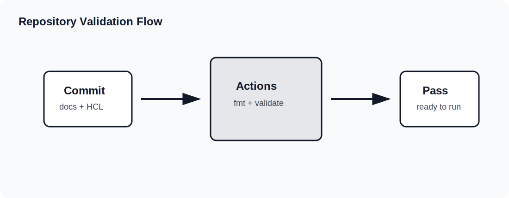

# Troubleshooting

Troubleshooting Terraform and Azure labs is easiest when you move in layers. Start with the current folder and Terraform command output. Then check provider initialization, variables, state, plan details, Azure resource status, networking, bootstrap extensions, and service-specific behavior. Do not jump straight to the most complex explanation.

This guide gives a practical troubleshooting workflow for Azure From Zero To Hero. It covers local command failures, Terraform validation errors, Azure provider authentication, naming conflicts, Windows VM readiness, IIS bootstrap, Load Balancer health, Bastion access, private endpoints, Azure SQL, GitHub Actions, and cleanup failures.

## First Rule: Find The Scope

Before fixing anything, identify the scope:

| Question | Why it matters |
|---|---|
| Which lesson folder am I in? | Terraform state and files are folder-specific |
| Which command failed? | `init`, `validate`, `plan`, `apply`, and `destroy` fail for different reasons |
| Did the failure happen locally or in GitHub Actions? | Local environment and CI runner have different context |
| Did Azure create any resources before the failure? | Partial applies may need cleanup or rerun |
| Is this a Terraform error or an Azure service error? | The fix path is different |

Run these commands first:

~~~powershell
Get-Location
terraform version
az account show
terraform fmt -check
terraform validate
~~~

If you are not in the intended lesson folder, stop and move to the correct folder before running more Terraform commands.

## Command Failure Map

| Failed command | Most likely problem | First check |
|---|---|---|
| `terraform init` | Provider, module, or backend setup | `versions.tf`, network access, backend config |
| `terraform fmt -check` | Formatting differs from Terraform style | Run `terraform fmt` |
| `terraform validate` | Syntax, schema, reference, or type issue | Read the first error block |
| `terraform plan` | Provider auth, variables, Azure lookup, state | `az account show` and variable values |
| `terraform apply` | Azure service validation or quota | Azure error code and resource name |
| `terraform destroy` | Azure delete timing or dependency | Rerun and inspect remaining resource |

Terraform errors are usually specific. Read from the first error downward. Later errors can be consequences of the first one.

## Authentication Problems

Provider authentication errors often happen before any Azure resource is changed. Start with:

~~~powershell
az account show
az account list --output table
~~~

Confirm:

| Check | Expected |
|---|---|
| Signed in | `az account show` returns account data |
| Subscription | The active subscription is the intended one |
| Tenant | The tenant matches the subscription |
| Provider config | `subscription_id` is correct or intentionally null |

If you use more than one subscription, set `subscription_id` in local `terraform.tfvars`. Do not commit that local file.

Example:

~~~hcl
subscription_id = "00000000-0000-0000-0000-000000000000"
~~~

If Azure CLI is signed in but Terraform still fails, run `terraform init` again and review the provider block.

## Provider Initialization Problems

Initialization downloads providers and modules. Failures can be caused by version constraints, network access, a locked provider file, or stale local `.terraform` data.

Safe local reset:

~~~powershell
Remove-Item -Recurse -Force .terraform
terraform init
~~~

Only remove `.terraform` from the current lesson folder. It is local cache data and can be recreated. Do not remove state files as part of a routine provider reset.

If a provider executable is locked by another process, close terminals or wait for the previous Terraform command to finish. On Windows, concurrent validation across many folders can temporarily lock provider executables.

## Formatting Problems

If `terraform fmt -check` fails, run:

~~~powershell
terraform fmt
terraform fmt -check
~~~

Formatting is not a design change. It normalizes spacing, alignment, and HCL layout. If formatting touches many files, review the diff anyway before committing.

## Validation Problems

`terraform validate` checks structure. Common validation errors include:

| Error type | Example cause |
|---|---|
| Unknown resource | Typo in resource address |
| Unsupported argument | Provider schema does not accept an argument |
| Invalid type | String provided where number expected |
| Missing required argument | Resource block incomplete |
| Invalid reference | Resource name changed but reference did not |

Fix validation errors before planning. A plan on invalid configuration is not meaningful.

## Variable Problems

Variables can fail through validation or through Azure service rules. Check `variables.tf` and local values.

Common issues:

| Symptom | Likely cause | Fix |
|---|---|---|
| Environment validation fails | Value is not `dev`, `test`, or `prod` | Use an allowed value |
| Admin source range rejected | Invalid CIDR format | Use `x.x.x.x/32` or another valid CIDR |
| Public DNS zone created unexpectedly | Boolean set to true | Set `create_public_dns_zone = false` |
| Remote state lookup fails | Placeholder storage account still used | Replace remote state variables |

The example files are safe placeholders. Real deployments may need local overrides.

## Naming Conflicts

Some Azure names must be unique. Storage accounts and Key Vault names are common examples. Azure From Zero To Hero uses compact prefixes and random suffixes in several lessons, but conflicts can still happen.

If Azure reports a name conflict:

1. Identify the exact resource name in the error.
2. Check whether the name must be globally unique.
3. Change `name_prefix` or `environment` in local values.
4. Run `terraform plan` again.

Do not change random suffix resources manually in state. Change configuration inputs and let Terraform calculate the new name.

## Quota And SKU Problems

Windows VMs and VMSS instances require regional quota. Azure may reject a plan during apply if the subscription lacks quota for a VM size or region.

Typical fixes:

| Option | Use when |
|---|---|
| Lower `instance_count` | VMSS or repeated VM lessons exceed quota |
| Use another VM size | The default size is unavailable |
| Change region | The region lacks capacity or quota |
| Request quota | You want to keep the size and region |

Always rerun `terraform plan` after changing size, count, or region.

## Windows VM Deployment Problems

For a Windows VM issue, validate in this order:

| Step | Check |
|---|---|
| 1 | Resource group exists |
| 2 | VM exists and provisioning state succeeded |
| 3 | NIC exists and is attached |
| 4 | NIC is in the expected subnet |
| 5 | Public IP exists if the lesson expects one |
| 6 | NSG allows the required traffic |
| 7 | VM extension succeeded if IIS is expected |

Use Azure portal or CLI to inspect the VM. Terraform output tells you the expected resource names and addresses.

## IIS Bootstrap Problems

If the IIS URL does not load, the VM may still be healthy. The extension might not have completed.

Check:

| Check | What to look for |
|---|---|
| VM extension status | Succeeded or failed |
| NSG rule | Port 80 allowed from expected source |
| Public IP or Load Balancer IP | Output value matches Azure |
| VM running state | VM is started |
| Probe health | Backend is marked healthy |

The Custom Script Extension runs after the VM exists. A short delay after apply is normal.

## RDP Problems

RDP issues can come from access path, NSG, credentials, or VM state.

For direct early-lab RDP:

| Check | Expected |
|---|---|
| Public IP | Exists and is assigned |
| NSG | Allows port 3389 from `admin_cidr` |
| Source IP | Your current public IP is inside `admin_cidr` |
| Username | Matches `admin_username` |
| Password | Retrieved from sensitive output |

For Bastion RDP:

| Check | Expected |
|---|---|
| Bastion host | Provisioned successfully |
| Bastion subnet | Named `AzureBastionSubnet` |
| Bastion public IP | Standard SKU |
| VM public IP | Not required |
| VM private IP | Present on NIC |

If Bastion exists but connection fails, verify the VM is running and credentials are correct.

## Load Balancer Problems

If a Load Balancer URL does not respond:

1. Confirm the public IP output.
2. Confirm the Load Balancer frontend points to that public IP.
3. Confirm the HTTP rule maps frontend port 80 to backend port 80.
4. Confirm the backend pool has members.
5. Confirm the probe exists.
6. Confirm IIS is installed on backend VMs or VMSS instances.
7. Confirm NSG rules allow HTTP.

A common mistake is to check only the frontend. The frontend can exist while every backend is unhealthy. Backend health is the key signal.

## VMSS Problems

VMSS failures can involve image availability, capacity, extension status, or load balancer membership.

Check:

| Area | What to inspect |
|---|---|
| Instance count | Matches `instance_count` |
| Instance health | Instances provisioned successfully |
| Extension | IIS extension applied to model and instances |
| Load Balancer | Backend pool connected to VMSS network profile |
| Autoscale | Settings exist and target VMSS ID is correct |

Autoscale does not immediately prove itself by changing capacity. In the lab, validating the autoscale setting and target resource is enough unless you intentionally generate load.

## NAT Gateway Problems

NAT Gateway affects outbound traffic only. It does not help inbound RDP or HTTP.

Check:

| Check | Expected |
|---|---|
| NAT Gateway | Exists in the resource group |
| Public IP association | NAT Gateway has a public IP |
| Subnet association | Target subnet is associated |
| Workload subnet | Resource is actually in that subnet |

If you expected inbound access to change, revisit the design. NAT Gateway is not the right feature for inbound publishing.

## Private DNS Problems

Private DNS problems usually appear as name resolution failures.

Check:

| Check | Expected |
|---|---|
| Private DNS zone | Exists |
| VNet link | Linked to the correct VNet |
| Record | Exists with expected private IP |
| Client location | Client is inside linked VNet path |

For private endpoint service zones, confirm the zone name matches the Azure service. For example, blob storage uses `privatelink.blob.core.windows.net`, and Azure SQL uses `privatelink.database.windows.net`.

## Private Endpoint Problems

Private endpoints have two parts: network connection and name resolution.

If access fails:

1. Confirm the target service exists.
2. Confirm the private endpoint exists.
3. Confirm the private service connection is approved or automatically connected.
4. Confirm the private endpoint is in the expected subnet.
5. Confirm the private DNS zone exists.
6. Confirm the private DNS zone group is attached.
7. Confirm the service name resolves to a private address.

Private endpoint troubleshooting without DNS validation is incomplete.

## Azure SQL Problems

Azure SQL private access failures usually involve public access settings, private endpoint DNS, or credentials.

Check:

| Check | Expected |
|---|---|
| SQL server | Created successfully |
| Public network access | Disabled in the lab pattern |
| Database | Exists on the server |
| Private endpoint | Connected to `sqlServer` subresource |
| Private DNS | Zone linked to VNet |
| Admin login | Matches `sql_admin_login` |
| Password | Retrieved from sensitive output |

If public access is disabled, testing from outside the VNet will not work. That is the intended security model.

## Remote State Problems

Remote state errors can come from missing storage, wrong names, missing permissions, or wrong state key.

Check:

| Variable | Meaning |
|---|---|
| `remote_state_resource_group_name` | Resource group containing backend storage |
| `remote_state_storage_account_name` | Storage account name |
| `remote_state_container_name` | Container name |
| `remote_state_key` | State file key |

If the remote state data source fails, verify the producing lesson created the storage and state file. A container can exist without the expected key.

## GitHub Actions Problems

The repository workflow validates formatting and Terraform configuration. It does not apply Azure resources.

If the workflow fails:

| Step | Likely issue |
|---|---|
| Checkout | Repository or runner issue |
| Setup Terraform | Action or network issue |
| Format | HCL formatting differs |
| Validate lesson folders | Terraform schema or reference issue |

Run the same checks locally:

~~~powershell
terraform fmt -check -recursive
.\scripts\Test-AzureFromZeroToHeroTerraform.ps1 -Validate
~~~

If local validation passes but CI fails, compare Terraform versions and read the failing folder from the workflow logs.

## Cleanup Problems

Destroy can fail because Azure deletion is eventually consistent or because a dependency is still busy.

Recommended response:

1. Read the first destroy error.
2. Wait a short time if Azure says an operation is in progress.
3. Rerun `terraform destroy`.
4. Inspect remaining resources by `Lab` tag.
5. Remove only resources you understand.

Do not delete state to force cleanup. If state is gone but resources remain, Terraform no longer knows how to manage them.

## Reading Azure Error Messages

Azure errors often include:

| Field | Meaning |
|---|---|
| Code | Error category |
| Message | Human-readable detail |
| Target | Resource or property involved |
| Details | Nested service-specific data |

Look for the resource name and property. For example, if the message mentions a subnet name, start with the subnet definition. If it mentions quota, do not edit networking. If it mentions a provider argument, check the resource schema or Terraform file.

## Triage Flow

Use this sequence for most problems:

1. Confirm current folder.
2. Confirm git status does not include accidental local runtime files.
3. Run `terraform fmt -check`.
4. Run `terraform validate`.
5. Run `az account show`.
6. Run `terraform plan`.
7. Read the first error carefully.
8. Inspect the Azure resource named in the error.
9. Fix the smallest relevant configuration issue.
10. Rerun from validation.

This loop keeps troubleshooting controlled. It avoids random edits and repeated applies without understanding the failure.

## What Not To Do

Avoid these shortcuts:

| Shortcut | Why it is risky |
|---|---|
| Delete state to fix errors | Terraform loses resource tracking |
| Broaden admin access permanently | Increases exposure |
| Commit local values | Leaks environment details |
| Change many files at once | Makes root cause hard to isolate |
| Ignore replacement in plan | Can destroy useful resources |
| Apply repeatedly without reading errors | Wastes time and can create partial state |

## Summary

Most Azure From Zero To Hero troubleshooting is a matter of narrowing scope. Check the current folder, command, provider setup, variables, state, plan, Azure resource status, network path, and service-specific health. Move from simple to complex. The repository is intentionally structured so each lesson has a small blast radius and a predictable file layout. Use that structure to debug one layer at a time.
