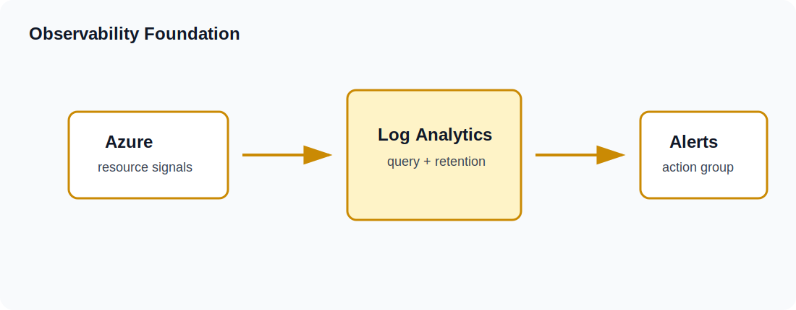

# Troubleshooting

## Fast Checks
| Symptom | Check | Typical Fix |
|---|---|---|
| Provider cannot authenticate | `az account show` | Sign in again or set `subscription_id` |
| Provider not installed | `terraform init` | Reinitialize the folder |
| Formatting check fails | `terraform fmt` | Review and commit formatting changes |
| Name conflict | Azure error mentions existing name | Change `name_prefix` or `environment` |
| VM quota error | Azure error mentions quota or SKU | Lower `instance_count` or choose another size |
| Destroy fails once | Rerun `terraform destroy` | Some Azure deletes are eventually consistent |

## Visual Triage

Start with the smallest failing scope: current folder, current state, current Azure resource group. The `Lab` tag identifies resources created by each lesson.

## Useful Commands
~~~powershell
az account show
terraform init
terraform fmt -check
terraform validate
terraform plan -out tfplan
terraform output
terraform destroy
~~~

