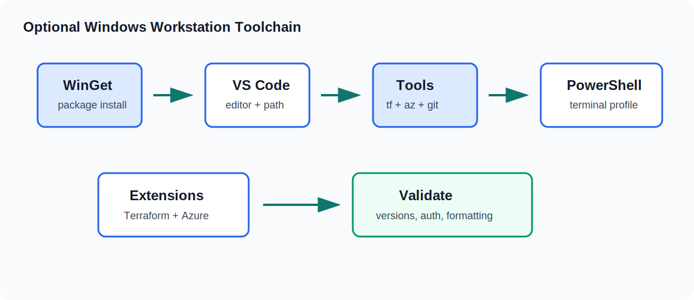

# Windows Workstation Tooling

This guide supports the optional `CLZ-090` setup lab. It explains how a Windows workstation should be prepared for Azure From Zero To Hero, why each tool exists, how the tools work together, and how to validate the setup before deploying Azure resources. It is intentionally more detailed than the lesson README because workstation issues can waste a lot of time if they are not diagnosed early.

The goal is a predictable local workflow: open the repository in VS Code, use PowerShell as the terminal, authenticate with Azure CLI, run Terraform from the correct lesson folder, validate formatting, review plans, and keep local values out of git.

## Toolchain Overview

The recommended workstation has these core tools:

| Tool | Purpose |
|---|---|
| WinGet | Installs and upgrades Windows tools from a command line |
| PowerShell 7 | Runs the lab commands and helper scripts |
| VS Code | Edits Terraform, Markdown, PowerShell, and workflow files |
| Terraform CLI | Plans, validates, applies, and destroys infrastructure |
| Azure CLI | Authenticates to Azure and inspects subscriptions/resources |
| Git | Tracks changes and pushes to GitHub |

You can run Terraform from another editor or terminal if you prefer, but the Azure From Zero To Hero documentation assumes PowerShell examples and VS Code-friendly navigation.

## Why Setup Gets Its Own Optional Lab

Workstation setup is not infrastructure, but it affects every infrastructure lesson. A missing `PATH` entry, wrong Azure subscription, old terminal session, or missing VS Code extension can make a correct Terraform lesson feel broken.

The optional setup lab prevents these problems by validating the toolchain before the first Azure deployment. It is placed before `CLZ-100` because it is preparatory. It does not replace the foundations lesson; it makes the foundations lesson easier to run.

Use the optional lab when:

| Situation | Why it helps |
|---|---|
| You are setting up a new Windows machine | Establishes all required tools |
| Terraform is not recognized | Checks install and `PATH` |
| Azure CLI signs in to the wrong account | Forces subscription review |
| VS Code terminal uses the wrong shell | Clarifies the terminal profile |
| Git is not configured | Catches repo workflow issues early |
| You want a repeatable checklist | Gives one place to validate setup |

## WinGet

WinGet is the Windows Package Manager command-line client. It can install and upgrade common development tools. On modern Windows client systems, it is often available through App Installer. Some enterprise or server environments may not include it.

Validate it with:

~~~powershell
winget --version
~~~

If WinGet is available, it gives a consistent install path:

~~~powershell
winget install --id Microsoft.PowerShell --source winget
winget install --id Git.Git --source winget
winget install --id Microsoft.VisualStudioCode --source winget
winget install --id Hashicorp.Terraform --source winget
winget install --exact --id Microsoft.AzureCLI
~~~

The `--exact` option is useful for Azure CLI because it ensures the official package ID is selected. If WinGet is blocked, use official installers instead.

## PowerShell 7

PowerShell 7 is the preferred shell for Azure From Zero To Hero. Windows includes Windows PowerShell 5.1, but PowerShell 7 is the modern cross-platform version and has a better experience with many current tools.

Validate it with:

~~~powershell
pwsh --version
~~~

PowerShell 7 can run side by side with Windows PowerShell 5.1. That means installing PowerShell 7 should not remove the built-in Windows PowerShell. In VS Code, choose a PowerShell terminal profile that points to `pwsh` when possible.

Recommended habits:

| Habit | Why |
|---|---|
| Use PowerShell for lab commands | The repo examples use PowerShell syntax |
| Run commands from a lesson folder | Terraform state and paths stay local |
| Use `Get-Location` before apply/destroy | Prevents wrong-folder operations |
| Keep one terminal per active lesson | Reduces context confusion |

## VS Code

VS Code is the recommended editor because it handles Markdown, Terraform, PowerShell, YAML, and integrated terminals well. It is also easy to open at the current repository path:

~~~powershell
code .
~~~

Validate the command:

~~~powershell
code --version
~~~

If `code` is not recognized after installation, close and reopen the terminal. If it still fails, repair the VS Code installation or confirm that the command-line launcher is on `PATH`.

## Recommended VS Code Extensions

Install the recommended extensions:

~~~powershell
code --install-extension hashicorp.terraform
code --install-extension ms-vscode.powershell
code --install-extension ms-azuretools.vscode-azureresourcegroups
code --install-extension github.vscode-github-actions
code --install-extension yzhang.markdown-all-in-one
~~~

| Extension | Value |
|---|---|
| HashiCorp Terraform | Terraform syntax, language support, and formatting help |
| PowerShell | Better `.ps1` editing and terminal integration |
| Azure Resource Groups | Azure browsing from the editor |
| GitHub Actions | Workflow file editing and pipeline navigation |
| Markdown All in One | Better documentation authoring |

Extensions do not replace command-line validation. Always trust `terraform fmt`, `terraform validate`, and GitHub Actions more than editor highlighting.

The repository tracks `.vscode/extensions.json` so VS Code can offer the same recommended extension set automatically. It also tracks a small `.vscode/settings.json` for shared Terraform, PowerShell, Markdown, line-ending, and whitespace defaults. User-specific editor files stay ignored.

## Terraform CLI

Terraform CLI is the main infrastructure tool. It reads `.tf` files, initializes providers, validates configuration, creates plans, applies reviewed plans, and destroys managed resources.

Validate it:

~~~powershell
terraform version
~~~

Basic workflow:

~~~powershell
terraform init
terraform fmt -check
terraform validate
terraform plan -out tfplan
terraform apply tfplan
terraform destroy
~~~

The optional setup lab has no Azure resources, but it still includes a valid Terraform configuration. That lets you test `init`, `fmt`, `validate`, and `plan` safely before running a real infrastructure lab.

## Azure CLI

Azure CLI authenticates the workstation to Azure and lets you inspect account context.

Validate it:

~~~powershell
az version
az login
az account show
az account list --output table
~~~

If more than one subscription is available, select the intended subscription:

~~~powershell
az account set --subscription "<subscription-id-or-name>"
az account show
~~~

This matters because Terraform can use Azure CLI authentication. A correct Terraform file can still deploy to the wrong place if the active Azure CLI subscription is wrong or ambiguous.

## Git

Git tracks changes in the repository and pushes updates to GitHub.

Validate it:

~~~powershell
git --version
git status
~~~

If git identity is not configured, set it:

~~~powershell
git config --global user.name "Your Name"
git config --global user.email "you@example.com"
~~~

Use your GitHub noreply address if you do not want to expose a personal email address in commits.

## VS Code Terminal Setup

Open VS Code in the repository:

~~~powershell
code .
~~~

Then open the integrated terminal. Confirm:

~~~powershell
$PSVersionTable.PSVersion
Get-Location
terraform version
az account show
~~~

If the terminal opens with an unexpected shell, change the default terminal profile. The important thing is consistency. The documentation is written for PowerShell, so using PowerShell removes translation errors.

## Folder Discipline

Terraform uses the current folder as the root module. That means folder discipline is a safety practice.

Before `plan`, `apply`, or `destroy`, run:

~~~powershell
Get-Location
Get-ChildItem
~~~

You should see the lesson files such as `versions.tf`, `providers.tf`, `variables.tf`, and `outputs.tf`. If you are in the repository root, move into a lesson folder. If you are in the wrong lesson folder, stop before running Terraform.

## Local Values

Each lesson provides `terraform.tfvars.example`. Copy it only when you need local overrides:

~~~powershell
Copy-Item terraform.tfvars.example terraform.tfvars
~~~

Then edit `terraform.tfvars` locally. Do not commit it. The repository ignores it because it may contain subscription IDs, admin CIDR ranges, or other workstation-specific values.

## Authentication Checks

Authentication issues are common. Use this quick sequence:

~~~powershell
az account show
az account list --output table
terraform init
terraform validate
~~~

If `az account show` fails, Terraform provider authentication may also fail. Fix Azure CLI sign-in first. If Azure CLI shows the wrong subscription, change it before planning.

## Proxy And Enterprise Restrictions

Some workstations are behind enterprise proxy, firewall, or software restriction controls. Symptoms can include failed downloads, blocked extension installation, or provider initialization failures.

Check:

| Symptom | Possible cause |
|---|---|
| WinGet fails to download | Package source blocked |
| Terraform provider download fails | Registry access blocked |
| VS Code extension install fails | Marketplace access blocked |
| Azure CLI login fails | Browser or device login restricted |

In managed environments, use approved software distribution channels and ask the platform team which package sources are allowed.

## Toolchain Validation Script

Run:

~~~powershell
.\scripts\Test-AzureFromZeroToHeroToolchain.ps1
~~~

The script checks required commands, prints version output, lists recommended VS Code extensions when possible, and checks Azure CLI sign-in. It does not install software and does not create Azure resources.

If the script reports a required command missing, install or repair that tool before starting `CLZ-100`.

## Version Strategy

The workstation should be modern, but it does not need to chase every release the moment it appears. Terraform, Azure CLI, VS Code, PowerShell, and Git all release updates on their own schedules. Updating everything at once right before a lab can create avoidable confusion because a behavior change may appear in more than one tool at the same time.

A practical strategy is:

| Tool | Update habit |
|---|---|
| Terraform CLI | Keep current enough to satisfy the `required_version` constraints in the lessons |
| Azure CLI | Update when authentication, provider, or Azure resource commands behave unexpectedly |
| VS Code | Keep stable channel updated through the normal updater |
| VS Code extensions | Update with VS Code unless an extension regression affects editing |
| PowerShell 7 | Keep on a supported version and review release notes before major upgrades |
| Git | Keep reasonably current, especially if GitHub authentication helpers change |

When a lab fails, avoid assuming the newest tool is always the answer. First confirm the folder, Azure account, subscription, variables, and Terraform initialization state. Upgrade tools when the error points toward missing command support, provider download problems, authentication behavior, or a known issue documented by the tool vendor.

For repeatable teaching environments, write down the working versions at the start of a cohort:

~~~powershell
pwsh --version
terraform version
az version
git --version
code --version
~~~

This gives you a baseline when comparing one student workstation with another. It also helps you explain whether a problem is caused by the lab files, a local install, or a newer tool version.

## PATH And Command Discovery

Most workstation problems are not Terraform problems. They are command discovery problems. A tool can be installed correctly but still fail from the terminal if the command folder is not on `PATH` or if the terminal was opened before installation finished.

Use these checks:

~~~powershell
Get-Command terraform
Get-Command az
Get-Command git
Get-Command code
Get-Command pwsh
~~~

`Get-Command` shows the executable that PowerShell will run. That is more useful than only checking a version number because it tells you which install path is active. If multiple copies of a tool exist, PowerShell uses the first matching command found through `PATH`.

If a newly installed command is missing, close every terminal window and open a new one. If it is still missing, check whether the installer completed successfully, whether the tool was installed for the current user or all users, and whether workstation policy blocks command-line launchers. Avoid manually editing global `PATH` unless you understand the existing entries. A broken `PATH` can affect many unrelated tools.

## VS Code Workspace Habits

VS Code works best when the repository root is opened as the workspace. Open the root folder that contains `README.md`, `wiki`, `scripts`, and the lesson folders:

~~~powershell
code .
~~~

Opening a single file is fine for quick reading, but it weakens the lab experience. Folder mode gives you search across the curriculum, relative Markdown links, extension recommendations, shared workspace settings, integrated terminal context, and Git status in the same window.

Recommended layout:

| Area | Suggested use |
|---|---|
| Explorer | Browse lesson folders and wiki pages |
| Editor | Keep the lesson `README.md` and Terraform files open |
| Terminal | Run PowerShell, Azure CLI, and Terraform commands |
| Source Control | Review local edits before commit |
| Search | Find variables, outputs, resource names, and troubleshooting notes |

Use one VS Code window for the curriculum and one terminal tab per active lesson. When switching lessons, open a new terminal or run `Set-Location` deliberately. Wrong-folder execution is one of the easiest ways to create confusing Terraform state.

## PowerShell Execution Policy

The helper scripts in `scripts` are PowerShell files. On some Windows systems, script execution policy may block local `.ps1` files. Check the current policy:

~~~powershell
Get-ExecutionPolicy -List
~~~

For a personal lab workstation, many users choose a current-user policy that allows local scripts:

~~~powershell
Set-ExecutionPolicy -Scope CurrentUser -ExecutionPolicy RemoteSigned
~~~

Use the policy required by your organization. The curriculum does not require lowering machine-wide policy. If you cannot change execution policy, you can still read the scripts and run the underlying commands manually. The script is a convenience, not a hidden dependency.

When running a script from the repository, use an explicit relative path:

~~~powershell
.\scripts\Test-AzureFromZeroToHeroToolchain.ps1
~~~

From inside `CLZ-090`, use:

~~~powershell
..\scripts\Test-AzureFromZeroToHeroToolchain.ps1
~~~

That habit makes it clear which script is being executed and prevents accidental reliance on a command with the same name elsewhere.

## Azure Account Hygiene

Azure CLI sign-in is workstation-level context. Terraform can use that context when the Azure provider authenticates through Azure CLI. This is convenient, but it means the active account and subscription must be checked before every real deployment.

Use this sequence before infrastructure lessons:

~~~powershell
az account show --query "{name:name, subscription:id, tenant:tenantId, user:user.name}" --output table
az account list --output table
~~~

If the wrong subscription is active, set it explicitly:

~~~powershell
az account set --subscription "<subscription-id-or-name>"
~~~

When you teach or repeat the lab across different environments, do not assume the last selected subscription is still correct. Browser sign-in, previous client work, and multiple tenants can change the context. Treat subscription confirmation like checking the current directory before `terraform apply`.

## Local Files And Repository Cleanliness

The workstation will produce local files during Terraform work. Some are safe to commit, and some must stay local.

| File or folder | Commit? | Notes |
|---|---|---|
| `README.md` | Yes | Lesson documentation |
| `.tf` files | Yes | Terraform configuration |
| `terraform.tfvars.example` | Yes | Safe template values |
| `terraform.tfvars` | No | Local values and possible secrets |
| `.terraform/` | No | Downloaded provider and module cache |
| `*.tfstate` | No | State can contain sensitive data |
| `tfplan` files | No | Plan files can contain environment details |

Before pushing changes, run:

~~~powershell
git status
~~~

Review the file list. If Terraform created local cache or state files, do not add them. The repository ignore rules should block common Terraform working files, but `git status` is still the final human checkpoint.

## Teaching Checklist

If you are turning this into your own course, record a simple workstation readiness checklist at the start:

| Topic | Instructor check |
|---|---|
| Windows account | User can install tools or has approved install path |
| Terminal | PowerShell 7 opens from Start menu and VS Code |
| Editor | VS Code opens the repository root |
| Terraform | `terraform version` works in a new terminal |
| Azure | `az account show` returns the intended subscription |
| GitHub | `git status` works and remote access is configured |
| Script policy | Local helper scripts can run or manual fallback is documented |

This checklist is useful because it separates course problems from workstation problems. If a learner cannot run `az account show`, the next Terraform lesson will not behave predictably. Fixing that early keeps the curriculum focused on infrastructure instead of emergency setup repair.

## Common Problems

| Problem | Cause | Fix |
|---|---|---|
| Command not recognized | Tool not installed or terminal not restarted | Reopen terminal or reinstall |
| VS Code opens but `code` fails | CLI launcher not on `PATH` | Repair install or update PATH |
| Azure CLI shows wrong account | Previous browser session | Run `az logout`, then `az login` |
| Terraform init fails | Network or provider registry issue | Check connection and proxy rules |
| Git push fails | Remote/auth issue | Check `git remote -v` and GitHub auth |
| VS Code terminal uses old shell | Default profile not set | Select PowerShell terminal profile |

## Validation Checklist

Before starting the main curriculum:

| Check | Command |
|---|---|
| PowerShell 7 | `pwsh --version` |
| Terraform | `terraform version` |
| Azure CLI | `az version` |
| Git | `git --version` |
| VS Code CLI | `code --version` |
| Azure sign-in | `az account show` |
| Repository opens | `code .` |
| Terraform validates optional lab | `terraform validate` from `CLZ-090` |

If all checks pass, the workstation is ready for `CLZ-100`.

## Official Documentation

Use official docs when an install path changes:

| Tool | Official documentation |
|---|---|
| WinGet | Windows Package Manager documentation |
| PowerShell | Microsoft PowerShell install docs |
| Azure CLI | Microsoft Azure CLI install docs |
| Terraform | HashiCorp Terraform install docs |
| VS Code | VS Code setup and command-line docs |

## Summary

A clean workstation setup is not glamorous, but it makes every Terraform lesson smoother. The expected Azure From Zero To Hero setup is PowerShell 7, VS Code, Terraform CLI, Azure CLI, Git, and a few editor extensions. Validate the tools before deploying resources, keep local values out of git, confirm Azure subscription context, and run Terraform from the correct lesson folder. Once those habits are in place, the rest of the curriculum becomes much easier to follow.
